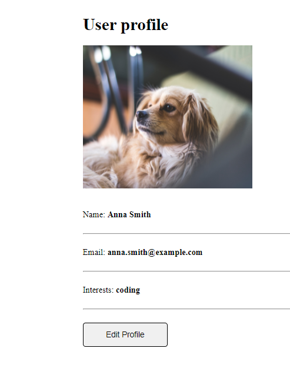

<!-- Social Links -->

[![LinkedIn][linkedin-shield]][linkedin-url]
[![Instagram][instagram-shield]][instagram-url]
[![Hashnode][hashnode-shield]][hashnode-url]

>
>

>

> 
> - `Vue.js is an open-source model–view–viewmodel front end JavaScript framework for building user interfaces and single-page applications.`
> - ` Vue. js (or simply Vue) is a lightweight, JavaScript framework for building reactive web user interfaces. Vue extends standard HTML and CSS to create a suite of powerful tools for building the front end of interactive web applications.`

> # All About `Teamable App Using VueJS` 😎

# **Gained expertise through this project :**

- Learnt indepth of `VUEJS` 

- Learned the importance of Virtual DOM.

- Understand how to make components in VueJS.

- Learned Event Handling. 

- Learned Vue-CLI.

># Designed With 😇
>## TECHNOLOGIES USED 
>

>## Making Use of Tools
>
>
>
>
>

# HERE IS THE PREVIEW HOW THIS PROJECT LOOKS😍
># [LIVE [HOSTED] PROJECT LINK](https://teamable-app-using-vue-js.vercel.app/ "Teamable App")
>

>## For any query you can reach out at brijeshvadaliya1@gmail.com I am happy to help 😎

# HAPPY LEARNING 🤩
>
>##  It is easier for a camel to go through the eye of a needle than for a developer who doesn’t use strict mode to enter the kingdom of heaven.

<!-- Linkedin -->

[linkedin-shield]: https://img.shields.io/badge/-LinkedIn-black.svg?style=for-the-badge&logo=linkedin&colorB=0B5FBB
[linkedin-url]: https://www.linkedin.com/in/brijesh-vadaliya-16b3a2202/

<!-- Instagram -->

[instagram-shield]: https://img.shields.io/badge/Instagram-%23E4405F.svg?style=for-the-badge&logo=Instagram&logoColor=white
[instagram-url]: https://www.instagram.com/brijesh_vadaliya_8128/

<!-- Hashnode -->

[hashnode-shield]: https://img.shields.io/badge/Hashnode-2962FF?style=for-the-badge&logo=hashnode&logoColor=white
[hashnode-url]: https://brijeshvadaliya8128.hashnode.dev/

